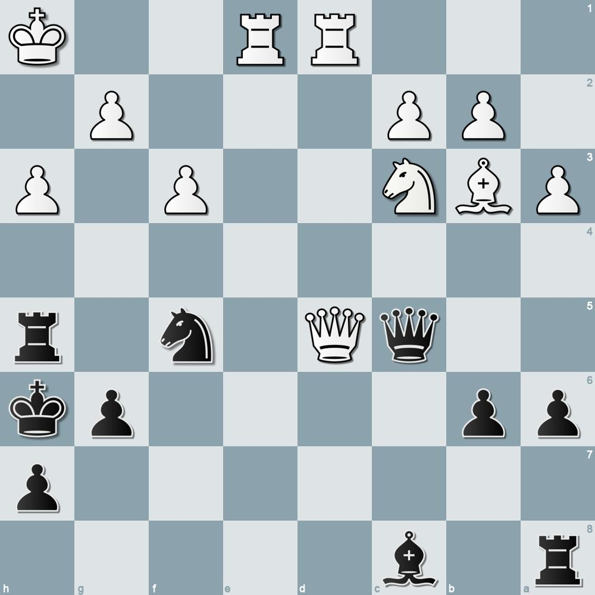
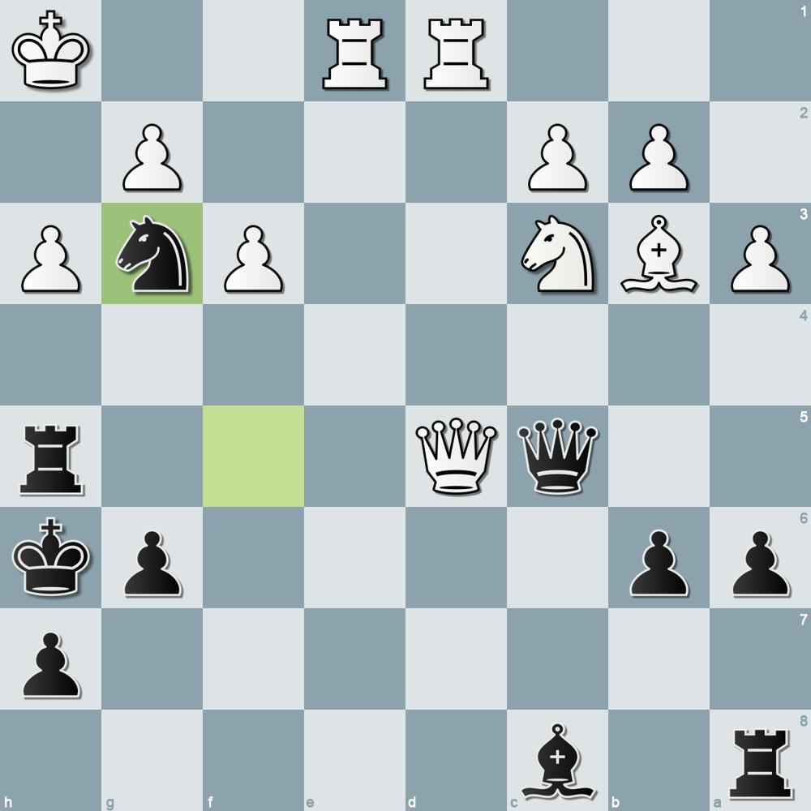
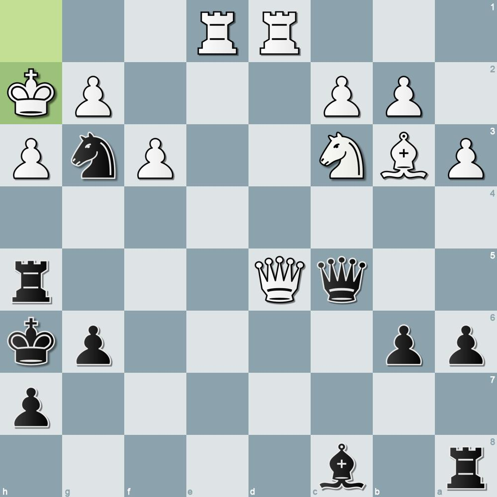
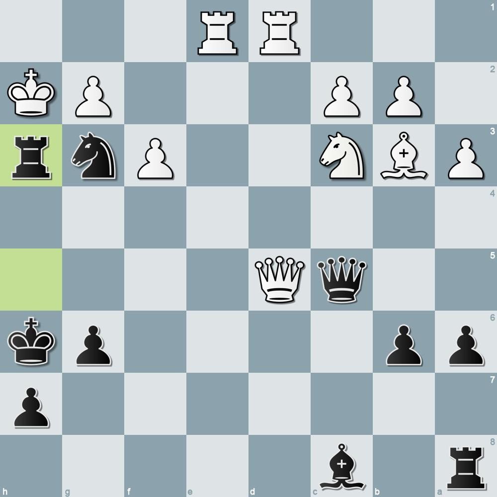
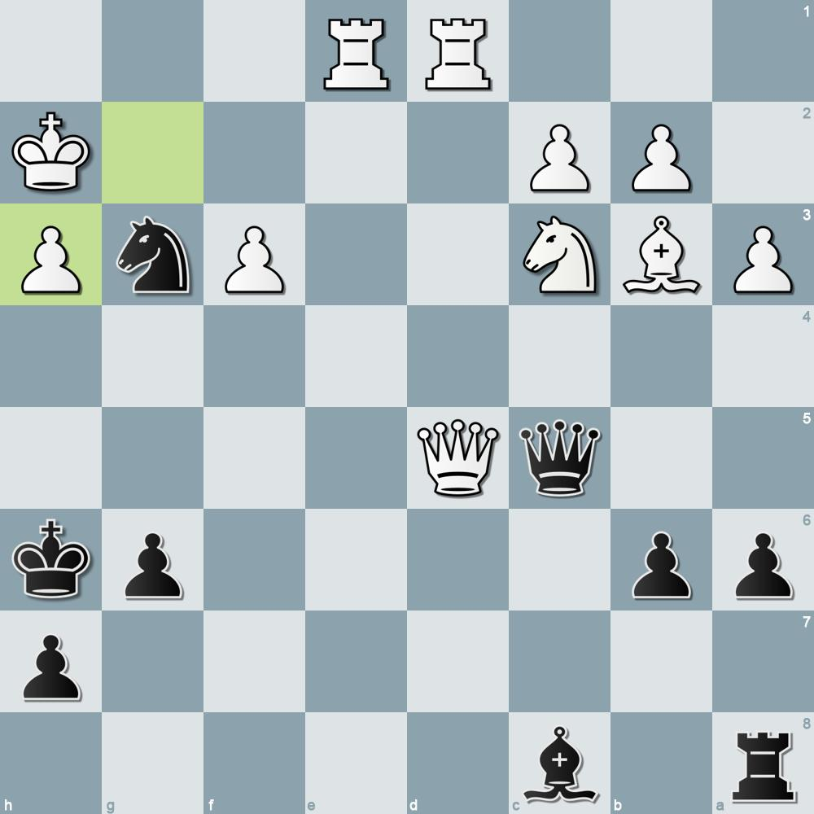
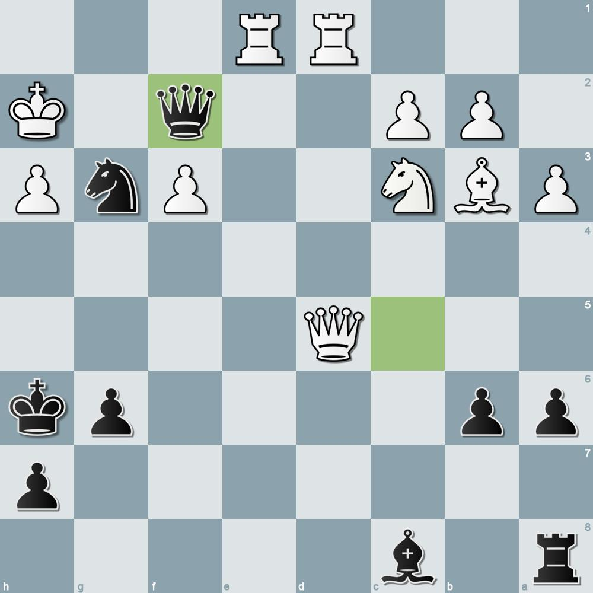

Chesscrunch - Chess Puzzles with Instagram Integration
=========
Chesscrunch is a small Python utility to generate chess puzzle graphics from the Lichess puzzle database. It produces a sequence of images (one per move/position) in the `Slides/` folder using selectable board themes and piece sets. The project includes a simple generator (`puzzle_gen.py`) and supporting assets (piece images and board themes). Optionally, the generated puzzles can be automatically uploaded to instagram.

Install dependencies (example)
------------------------------
This project requires Python 3.10+ to use the `automate.py` Instagram automation (the `instagrapi` package uses Python 3.10+ typing syntax). The `puzzle_gen.py` generator itself will typically work with Python 3.8+, but to keep the environment consistent use Python 3.10+.

Run these commands in your shell (zsh):

```bash
# macOS example using pyenv or system Python 3.10+:
python3.10 -m venv .venv
source .venv/bin/activate
pip install --upgrade pip
pip install -r requirements.txt
```

Run the generator (standalone)
--------------------------------
If you only want to generate images locally (no Instagram upload), run the generator directly:

```bash
python puzzle_gen.py
```

Generated slides will be saved to the `Slides/` directory as `Slide0.jpg`, `Slide1.jpg`, ... for each move/position.

OR — Run with Instagram integration
----------------------------------
You can instead run the full automation which generates slides and uploads them to Instagram using `instagrapi`.

Usage (command-line):

```bash
# Pass username and password on the command line
python automate.py -u your_username -p your_password

# Or use shell variables to avoid the password appearing in your shell history
python automate.py -u "$INSTA_USER" -p "$INSTA_PASS"
```

Examples
--------








